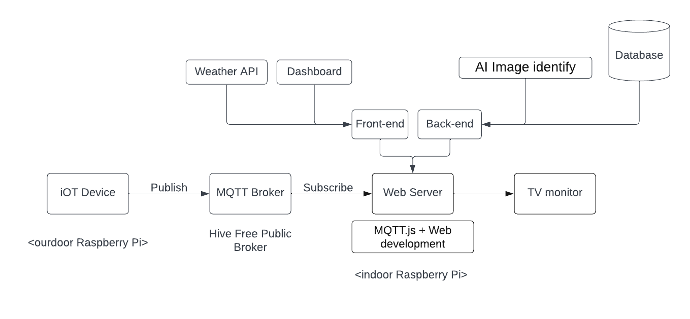

# Bird Feeder - Dashboard

Bird Feeder is a small project for our IT project **work term**. It contains iOT device side and Web Server side. On the iOT device side, we use one outside Raspberry Pi to collect different kind of data, like: image of bird, temperature, humidity, light, etc. and send these data to MQTT Broker. We also have another inside Raspberry Pi connected to the TV monitor. We run a Web Server on this Pi and use it to deploy our web application - **Dashboard**. 



In this document, we will **only** introduce the Dashboard part of this project.

## Keywords
MQTT, Raspberry Pi, Web Server, Web Application, Dashboard, iOT, Python, JavaScript, HTML, CSS, etc.

## Project Structure

```bash   
NodejsAPISave # Nodejs API Server
├──  api.js # read images from our AI processed folder and send them to the web server 
├──  main.js # connect to MQTT Broker and save image to the local folder 
├──  run.js # run api.js and main.js
WebServer # Dashboard Web Server
├── static    # static files
│   ├── css
        └── style.css # main css file
│   └── images
│   └── js
        └── bundle.js # main js file
├── templates # html templates
├── runWebServer.py # run web server
```

## Usage

### Step 1
run the following command to start the Nodejs API Server and save images from MQTT Broker:
```javascript
node run.js
```
Then we can access the API Server through the following URL:

```bash
http://localhost:3000/api/images
```

### Step 2

Our web server use **Flask** as the framework. To run the web server, you need to install Flask first, and then run the following command:

```python3
python3 runWebServer.py
```

Then we can access the web server through the following URL:

```bash
http://localhost:80/
```

## License

[MIT](https://choosealicense.com/licenses/mit/)
